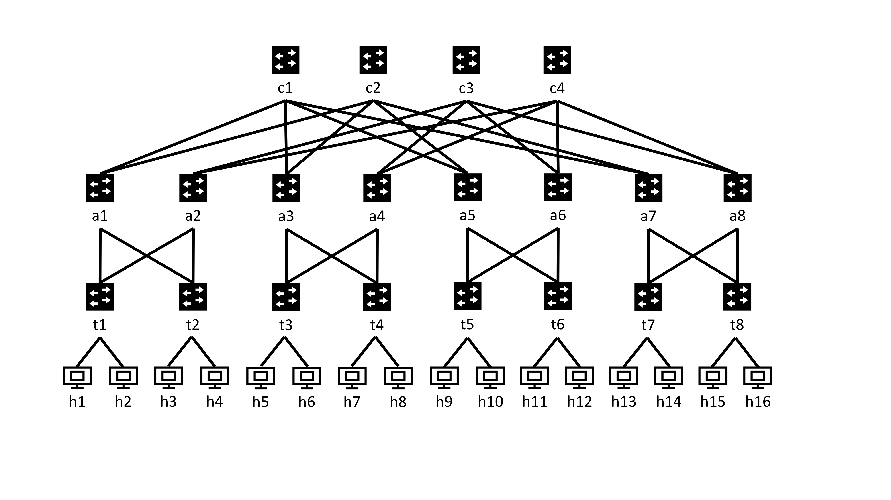

# Project 8: Software Load Balancing

## Objectives
- Implement software load balancers
- Use VIP and IPinIP to deliver traffic
- Understand the benefit of Direct Server Return(DSR)

## Overview
Software load balancers distribute connections among various servers in order to have more efficient use of the number of servers. To the client, all traffic is sent and received from one IP address, but since the IP address does not belong to any machine, but belongs to the system of servers and load balancers, it is called a Virtual IP(VIP).

Packets are sent to the Load Balancers, then the packets are forwarded to servers, where a response is formed and sent to the client. The message from the server can be sent either going through the Load Balancer, or directly to the client. The benefit of Direct Server Return is that it avoids the load balancer as a bottleneck, as responses from the server are generally larger than the requests from the client.

Disclaimer: Since the software load balancer is going to be implemented using scapy on layer 7, the load balancer doesn't improve performance in our case.

To learn more about load balancing, please take a look at [Ananta](https://dl.acm.org/citation.cfm?id=2486026).

<!-- <mark>Cite Ananta paper as the reference</mark> -->

## Getting Started
In this project, we will be implementing a software load balancer using [scapy](https://scapy.readthedocs.io/en/latest/), a packet parsing package in python.
To install scapy, run `pip install scapy` in the terminal.

## Topology
As usual, we will use the fattree topology for this project.


## Dataplane Code
Copy your p4 code from the ECMP Routing Project. This code does not need to be changed for this project.

## Routing Controller
Copy your routing controller python code from ECMP project. We will use this as a starting point.

Since we need to support a VIP in our network, we have to modify our controller to support routing to the Virtual IP. For this project, we will use 20.0.0.1 as our VIP, and our load balancers will be on h1 and h2.

The routing rules should be modified so that any packet with destination IP as the VIP is routed to the load balancers.

The implementation of this controller might change based on your specific implementation of the ECMP controller, but here are some general tips to help you:
- On switches other than t1(the one right before h1 and h2), the packets should be routed as if they are going to h1, or h2.
- At t1, you should use ECMP again to split up packets destined for 20.0.0.1 between the two load balancers

### Testing the Routing Controller
#### Test 1
```
sudo p4run --conf fat_tree_one_pod_app.json
```
then run `pingall` in mininet. If all pings go through, then your routing should work for normal packet routing.
#### Test 2
run
```
sudo tcpdump -enn -i t1-eth1
```
and
```
sudo tcpdump -enn -i t1-eth2
```
so we can monitor the packets going to h1(through t1-eth1) and the packets going to h2(through t1-eth2).
Now if you run
```
mininet>h16 ping 20.0.0.1
```
then you should see only packets going to one of the load balancers. If you run ping from another host, the load balancer that receives the packet might change.

If you see that packets being sent to 20.0.0.1 are being sent to h1 or h2, then your routing controller should work.

## Load Balancer
The load balancer needs to:
1. receive packets
2. encapsulates packets with another IP header
3. select the server to send to based on a hash of the five tuple
4. set the destination IP to be the server IP
5. send the packet

### Sniffing Packets
This section will show you how to read(sniff in our case) packets with scapy

First, we need to import scapy with
``` python
from scapy.all import *
```

To read the incoming packets, we will use the `sniff` function in the scapy package.
This function sniffs for packets and sends them to the function that we pass in the `prn` argument.
We can also add a `filter` argument that can filter packets before passing them into the function.
For example,
``` python
sniff(filter="tcp and dst host 10.1.2.1", prn=do_something)
```
will sniff for packets that use the TCP protocol, and are destined for the IP 10.1.2.1. Then, the packet will be passed into the do_something function that we define.

In our case, we need to sniff for TCP packets going to 20.0.0.1.

### Forging packets
In order to send the packet to the server, we have to encapsulate the received packet with scapy.

We will encapsulate the packet with IPinIP.
The IPinIP protocol is when you have an IP packet that is encapsulated by another IP header. Thus, the inner packet will be routed based on the outer header, but the information in the inner header will stay the same. The IPinIP protocol is important for DSR, because it gives the server access to the client IP address and the client port.

Here is an example of how to forge a TCP packet with scapy:

```python
packet = Ether() / IP(dst="10.1.2.1") / TCP(sport=333, dport=222)
```

If you want to debug and print out what your packets look like, just use
```python
packet.show() # show packet before computing checksums, etc.
```
 or
```python
packet.show2() # show packet after computing checksums, etc.
```

After you have created your packet, send it with the `send` function, which sends the packet at layer 3, or the `sendp` function, which sends at layer 2.

Hint: when sending the packets to the server, try sending to the MAC address of the switch.
<!-- I do not know why sending with `send` to the server doesn't work with scapy, but sendp works perhaps something to do with IPinIP. when you use `send` command, scapy automatically does ARP and adds an Ether header to it. -->

### Parsing Packets
Packet headers in scapy are formed of layers. To access these layers, do
```
packet[Ether]
```
Each layer contains all layers after it, for example, `packet[Ether]` includes the IP header, the TCP header, and the data payload. 

Another way to traverse the header layers is to use `.payload`. For example,
```
packet[IP].payload
```
accesses the TCP header for TCP packets. This could be useful when parsing IPinIP headers, as there are two IP headers, and `packet[IP]` will only return the first IP header.

### Hashing
Hashing in this project is used to determine the flow that the packet belongs to. That way, the load balancer can determine which server to send the packet to.
If the hash is not consistent, or packets are sent to a random server, then the connection will be disrupted.

To hash the five-tuple, you can use any consistent hash function.

### Testing the Load Balancer

## Host Agent
 - add VIP to eth0 interface
 - decapsulate the IPinIP packet
 - send to server

### Adding VIP to Interface
The host agent's job is to decapsulate the IPinIP packets before sending it to the server. In our project, the host agent will be run on the same machine as the server.
The server will listen on the VIP, so when it replies, the source address will be the VIP.
This means that the host agent must send the decapsulated packets to the VIP. Normally, these packets would be routed to the load balancers, but in this case, we will add the VIP to a local interface so that packets destined for the VIP get routed to the server.
This rule will be specifically for the server.

We can add the IP address to the interface with `ip addr add`. Since we want to add to the eth0 interface, we will specify that `dev hX-eth0`(with X being the host number).

### Decapsulation and Delivery

Receiving the packets should be the same as the load balancer(i.e. with `sniff`). In order to decapsulate, you can use scapy packet parsing.
Sending packets can be done with `send`.

### Testing the Host Agent

## Testing
Remember to run `sudo service lightdm start` to have a GUI.


1. run `xterm` to open an external terminal for the load balancers, clients and servers(you can open many terminals with 1 command through something like this `xterm h1 h2 h16`)
 1a. for each server, open 2 terminals
2. On the load balancers, run `python load_balancer.py`
3. On the server terminals, run `agent.py`
4. Run `php -S 20.0.0.1:80 -t ~/resources/wwwroot` on every server.
5. Run `wget 20.0.0.1` on each client.

<!--- sending IPinIP packets from the LB to the server results in ICMP packets(destination unreachable, protocol unreachable) to be sent back to the load balancer. This doesn't affect performance. It may be solved by adding an IPinIP tunnel.
There is also sometimes a bug where pinging or sending packets to the VIP results in ttl exceeded because of a routing loop at the LB.-->

<mark>unclear where we run host agent and load balancer in the topology</mark>
